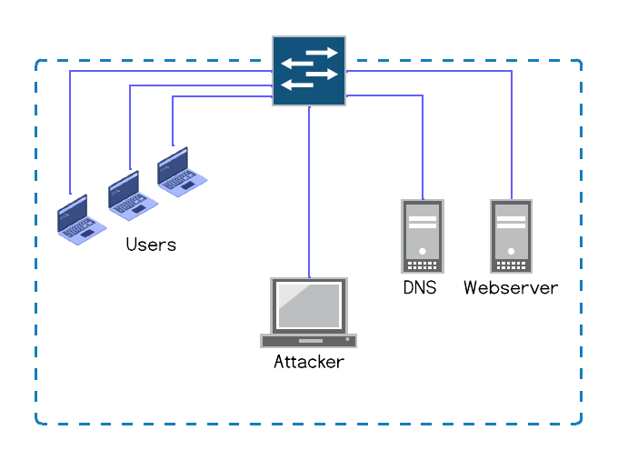

## LAB3 - ARP Spoofing
In this lab we will be performing an attack on a simple network using ARP to take over communication between a host and a server. 

## Requirements
- [Docker](https://docs.docker.com/engine/install/) and [Docker compose](https://docs.docker.com/compose/install/)
- Code editor ([VS code](https://code.visualstudio.com/download) is recommended)
- git (for window instructions click [here](https://git-scm.com/downloads/win))

## Instructions
- Install the required software.
- Start docker if required (Windows and Mac)
- Open a terminal window and type `docker compose up` , this will start all the machines in the network.
- Open the project in `VS code` and complete all `todos` in the file
- Open a second terminal window and connect to the attacker host `docker exec -it lab2-attacker-1 bash`.
- While in the attacker container, run the command `python3 arpspoof.py`

## Submission
### Submit your code
One all instructions are completed and your code is working, submit it
- run `git checkout -b <student_id>` (replace `<student_id>` with your student id)
- run `git add -u`
- run `git commit -m "solution submission"`
- rub `git push origin master <student_id>`

### Submit report
- Submit PDF report to e-learning